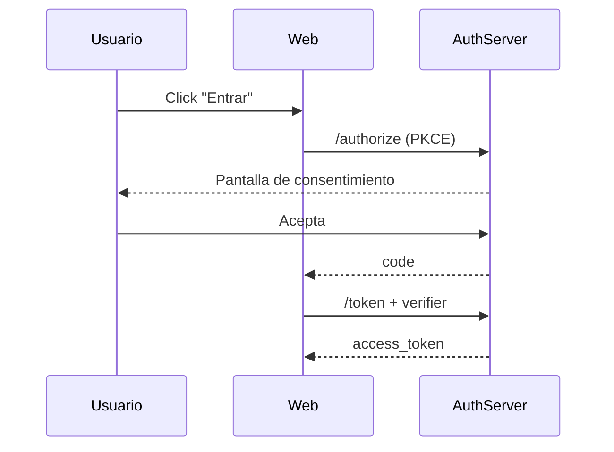

# Flujo de login con OAuth

```mermaid
sequenceDiagram
    participant U as Usuario
    participant W as Web
    participant A as AuthServer
    U->>W: Click "Entrar"
    W->>A: /authorize (PKCE)
    A-->>U: Pantalla de consentimiento
    U->>A: Acepta
    A-->>W: code
    W->>A: /token + verifier
    A-->>W: access_token
```

El `verifier` nunca sale del navegador; por eso PKCE protege contra intercepción del `code`.
